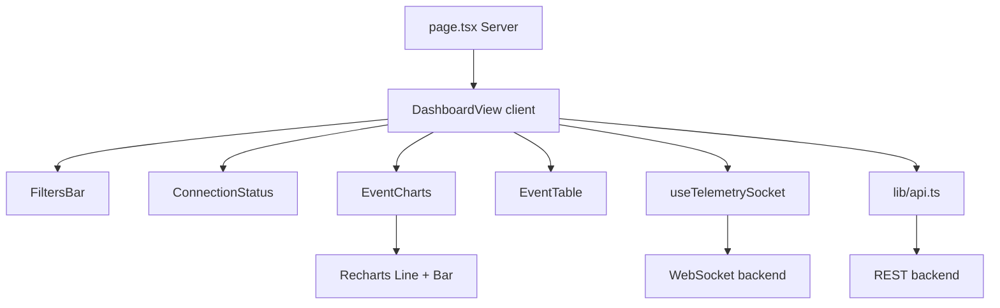
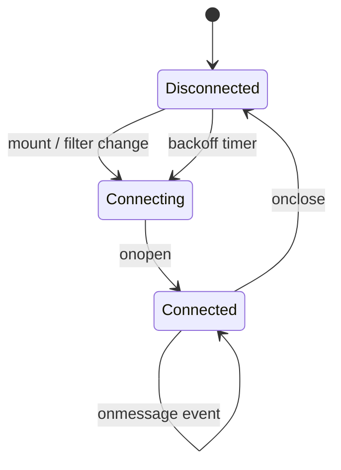

# Arquitetura — Componentes do Dashboard (Fase 2)

## Mapa de componentes

## Responsabilidades

| Arquivo | Tipo | Responsabilidade |
|---|---|---|
| `DashboardView.tsx` | Client | Orquestra estado, filtros, bootstrap e WS |
| `useTelemetrySocket.ts` | Hook | Conexão WS, reconnect backoff, buffer 100 eventos |
| `EventTable.tsx` | UI | Tabela scrollável com badges de level |
| `EventCharts.tsx` | UI | Gráfico temporal (line) + distribuição por level (bar) |
| `ConnectionStatus.tsx` | UI | Indicador visual de conexão WS |
| `FiltersBar.tsx` | UI | Filtro por service e level |
| `lib/api.ts` | Util | fetch REST + construção da URL WebSocket |
| `lib/format.ts` | Util | Formatação de datas, cores por level |

## Hook `useTelemetrySocket`

**Parâmetros de reconexão:**
- Backoff inicial: 1s
- Multiplicador: 2x
- Máximo: 30s
- Buffer circular: 100 eventos

## Tema visual

- Background: `#0f1419` (surface)
- Cards: `#1a2332` (surface-card)
- Bordas: `#2d3748` (surface-border)
- Accent positivo: emerald (conexão OK, level info)
- Accent negativo: red (level error, desconectado)
