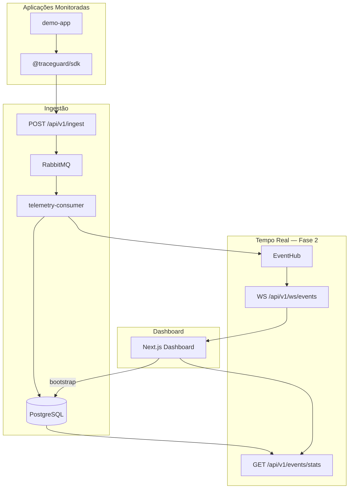
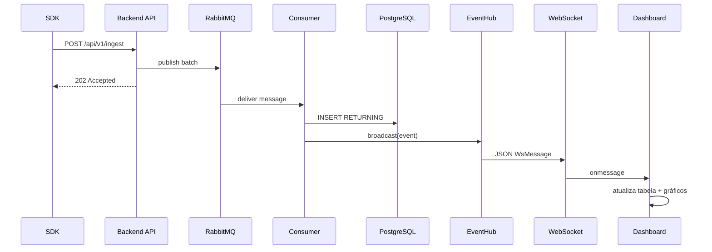

# Arquitetura — Fase 2: Visão Geral

## Fluxo completo (Fase 1 + Fase 2)

## Sequência: evento do SDK até o dashboard

## Endpoints da Fase 2

| Endpoint | Protocolo | Função |
|---|---|---|
| `/api/v1/events` | HTTP GET | Bootstrap — últimos N eventos |
| `/api/v1/events/stats` | HTTP GET | Agregações para gráficos |
| `/api/v1/ws/events` | WebSocket | Push em tempo real |
