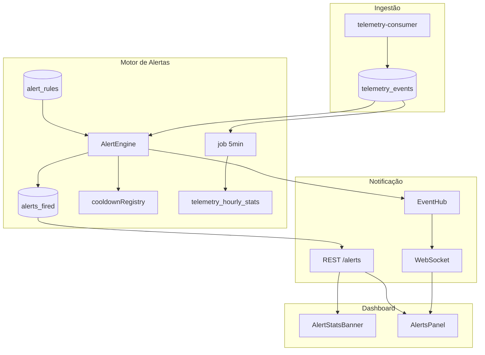
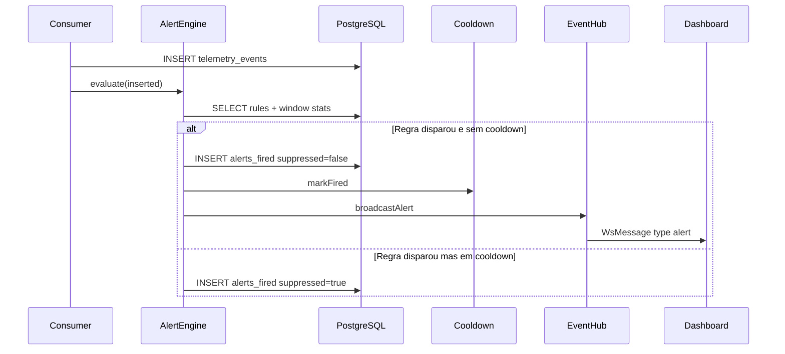

# Arquitetura — Fase 3: Motor de Alertas

## Visão geral



## Sequência de avaliação



## Tabelas

| Tabela / View | Função |
|---|---|
| `alert_rules` | Definição de regras (threshold, janela, cooldown) |
| `alerts_fired` | Histórico de alertas acionáveis e suprimidos |
| `telemetry_hourly_stats` | MV para agregação horária (refresh a cada 5 min) |

## Regras seed padrão

| Nome | Tipo | Threshold | Janela | Cooldown |
|---|---|---|---|---|
| Taxa de erro elevada | error_rate | 20% | 5 min | 15 min |
| Pico de erros | error_count | 10 | 5 min | 10 min |
| Rajada no mesmo trace | error_burst | 3 | 1 min | 5 min |

## Teste de stress

```bash
pnpm dev:demo:stress
```

Gera 15 erros HTTP no mesmo trace para disparar regras `error_count` e `error_burst`.
