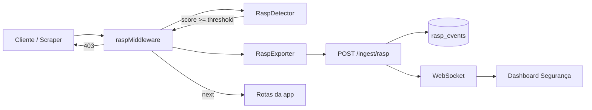

# Fase 4 — Arquitetura RASP

## Visão geral

O módulo RASP intercepta requisições HTTP **incoming** na aplicação monitorada, aplica heurísticas de detecção e opcionalmente bloqueia com 403. Eventos são exportados ao backend e exibidos na aba **Segurança** do dashboard.



## Componentes

| Camada | Arquivo | Responsabilidade |
|---|---|---|
| SDK | `packages/sdk/src/rasp/detector.ts` | Orquestra heurísticas e calcula score |
| SDK | `packages/sdk/src/rasp/rate-limiter.ts` | Janela deslizante por IP (60s) |
| SDK | `packages/sdk/src/rasp/fingerprints.ts` | UA suspeitos e headers esperados |
| SDK | `packages/sdk/src/interceptors/express.ts` | Middleware Express |
| Backend | `apps/backend/src/api/rasp-routes.ts` | Ingest e consultas REST |
| Backend | `apps/backend/src/db/rasp.ts` | Persistência PostgreSQL |
| Dashboard | `RaspPanel`, `RaspStatsCharts` | Visualização |

## Correlação com APM

Cada request incoming passa por `withIncomingTrace()` (AsyncLocalStorage), gerando `traceId`/`spanId` antes da análise RASP. O mesmo identificador aparece em:

1. Evento RASP (`rasp_events.trace_id`)
2. Logs HTTP outgoing instrumentados pelo SDK
3. Dashboard (coluna Trace na tabela de segurança)

## Demo

```bash
pnpm dev:backend          # :3001
pnpm dev:demo-api           # :4000
pnpm demo:scrape            # simula bot
pnpm dev:dashboard          # aba Segurança
```

## Limitações (PoC)

- Rate limiter in-memory (single process)
- Apenas middleware Express (Fastify na Fase 5)
- Heurísticas estáticas (sem ML)
