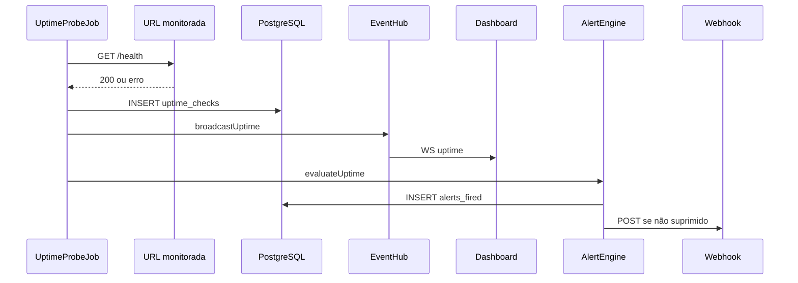

# Fase 5 — Arquitetura Uptime e Notificações

## Fluxo



## Componentes

| Módulo | Responsabilidade |
|---|---|
| `jobs/uptime-probes.ts` | Scheduler 15s, respeita `interval_sec` |
| `uptime/prober.ts` | fetch + timeout + classificação status |
| `db/uptime.ts` | CRUD monitors, stats, falhas consecutivas |
| `notifications/webhook.ts` | POST Slack-compatible |
| `realtime/redis-bridge.ts` | Pub/sub entre backends |

## Teste manual

```bash
pnpm docker:up          # inclui Redis
pnpm db:migrate
pnpm dev:demo-api
pnpm dev                # backend + dashboard
# Desligar demo-api → em ~2 min status down + alerta
```
