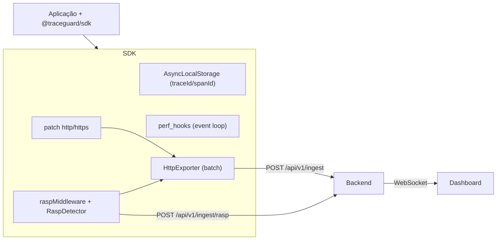

# @traceguard/sdk

Agente de telemetria e proteção em runtime para aplicações Node.js. É a **biblioteca** que você instala dentro da aplicação a ser monitorada; ela coleta telemetria (APM), gera traces correlacionados e aplica proteção RASP contra scraping/bots, exportando tudo para o backend do TraceGuard.

> Parte do monorepo [TraceGuard](../../README.md). A biblioteca **instrumenta** a aplicação; o backend e o dashboard **monitoram** os dados recebidos.

## O que a biblioteca faz

| Capacidade | Descrição |
|---|---|
| **APM / Telemetria** | Instrumenta chamadas HTTP de saída, mede duração e atraso do event loop, e exporta logs estruturados em lote para o backend. |
| **Tracing distribuído** | Usa `AsyncLocalStorage` (sobre `async_hooks`) para propagar `traceId`/`spanId` automaticamente através de Promises, callbacks e microtasks. |
| **RASP** | _Runtime Application Self-Protection_ — middleware Express que detecta bots, rate limit e varreduras sequenciais, podendo bloquear com HTTP 403. |
| **Rate limit distribuído** | Janela deslizante por IP em memória ou via **Redis** (sorted sets), para múltiplas réplicas. |

## Instalação

No monorepo, já é resolvido via workspace:

```jsonc
// package.json da app monitorada
{
  "dependencies": {
    "@traceguard/sdk": "workspace:*"
  }
}
```

`express` e `ioredis` são **peer dependencies opcionais** — instale apenas se for usar o middleware RASP e/ou o rate limit via Redis.

```bash
pnpm add express ioredis
```

## Uso básico (APM + tracing)

Chame `init()` uma única vez no bootstrap da aplicação:

```ts
import { init, shutdown, withTraceAsync, getContext } from "@traceguard/sdk";

init({
  serviceName: "minha-api",
  endpoint: "http://localhost:3001/api/v1/ingest",
});

await withTraceAsync(async () => {
  console.log(getContext()?.traceId); // mesmo traceId em toda a cadeia async
  await fetch("https://exemplo.com/dados"); // chamada HTTP instrumentada
});

// no encerramento gracioso (SIGTERM/SIGINT)
await shutdown(); // faz flush final do buffer de telemetria
```

## Uso com RASP (Express)

```ts
import express from "express";
import { init } from "@traceguard/sdk";
import { raspMiddleware } from "@traceguard/sdk/express";

init({
  serviceName: "demo-api",
  endpoint: "http://localhost:3001/api/v1/ingest",
  rasp: {
    enabled: true,
    mode: "block",              // "monitor" só registra; "block" retorna 403
    maxRequestsPerMinute: 60,
    blockThreshold: 70,
    sequentialScanThreshold: 20,
    redisUrl: process.env.REDIS_URL, // opcional — rate limit distribuído
  },
});

const app = express();
app.set("trust proxy", true);  // necessário para ler X-Forwarded-For
app.use(express.json());
app.use(raspMiddleware());
```

Quando uma requisição é bloqueada, a resposta é:

```json
{
  "error": "Request blocked by TraceGuard RASP",
  "threatType": "bot_user_agent",
  "traceId": "…",
  "score": 90
}
```

## Configuração

### `TraceGuardConfig` (`init`)

| Campo | Tipo | Default | Descrição |
|---|---|---|---|
| `serviceName` | `string` | — | Nome do serviço exibido no dashboard. |
| `endpoint` | `string` | — | URL de ingestão do backend (`/api/v1/ingest`). |
| `flushIntervalMs` | `number?` | `5000` | Intervalo de flush do buffer de telemetria. |
| `maxBatchSize` | `number?` | `100` | Máximo de eventos por lote (também dispara flush). |
| `rasp` | `Partial<RaspConfig>?` | — | Configuração RASP (desliga com `enabled: false`). |
| `raspEndpoint` | `string?` | `${endpoint}/rasp` | Endpoint de ingestão de eventos RASP. |

### `RaspConfig` (`rasp`)

| Campo | Default | Descrição |
|---|---|---|
| `enabled` | `true` | Liga/desliga o módulo RASP. |
| `mode` | `"block"` | `"monitor"` (só registra) ou `"block"` (403 ao exceder o threshold). |
| `maxRequestsPerMinute` | `60` | Limite por IP em janela de 60s. |
| `blockThreshold` | `70` | Score mínimo (0–100) para bloquear. |
| `sequentialScanThreshold` | `20` | Paths distintos por IP em 60s para sinalizar varredura. |
| `redisUrl` | — | Se definido, usa Redis para rate limit distribuído. |

## Heurísticas RASP

Os scores são somados (limitados a 100) e o `threatType` primário é o de maior severidade.

| Tipo | Detecção | Score |
|---|---|---|
| `sequential_scan` | IP acessa muitos paths distintos em 60s | +60 |
| `bot_user_agent` | User-Agent de bot conhecido (scrapy, curl, python-requests…) | +50 |
| `rate_limit` | IP excede `maxRequestsPerMinute` | +40 |
| `missing_headers` | Ausência de `accept`/`accept-language` em rotas browser-like | +20 |

## API pública

```ts
// Núcleo / APM
init(config: TraceGuardConfig): void
shutdown(): Promise<void>
getServiceName(): string

// Tracing
withTrace<T>(fn: () => T): T
withTraceAsync<T>(fn: () => Promise<T>): Promise<T>
getContext(): TraceContext | undefined
createRootContext(): TraceContext

// RASP runtime
getRaspRuntime(): RaspRuntime | null

// Subpath "@traceguard/sdk/express"
raspMiddleware(options?: Partial<RaspConfig>): RequestHandler
```

## Como funciona (arquitetura)



- **`core/context.ts`** — `AsyncLocalStorage` para propagação de contexto.
- **`core/perf.ts`** — medição via `perf_hooks` e atraso do event loop.
- **`interceptors/http.ts`** — patch de `http`/`https` para instrumentar requisições de saída.
- **`exporters/http-exporter.ts`** — buffer em memória com flush periódico e re-enfileiramento em falha transitória.
- **`rasp/detector.ts`** — orquestra heurísticas e calcula score.
- **`rasp/redis-rate-limiter.ts`** — rate limit em memória ou via Redis (sorted sets).
- **`interceptors/express.ts`** — middleware Express RASP.

## Limitações (PoC / TCC)

- Apenas middleware **Express** (Fastify previsto em fase futura).
- Heurísticas RASP estáticas (sem ML).
- Rate limit em memória não escala horizontalmente sem `redisUrl`.

## Referências

- [Visão geral da arquitetura](../../docs/architecture/fase-2-visao-geral.md)
- [Arquitetura RASP](../../docs/architecture/fase-4-rasp.md)
- [ADR 005 — RASP em runtime](../../docs/adr/005-rasp-runtime-protection.md)
- [Referência da API do backend](../../docs/api-v1.md)
